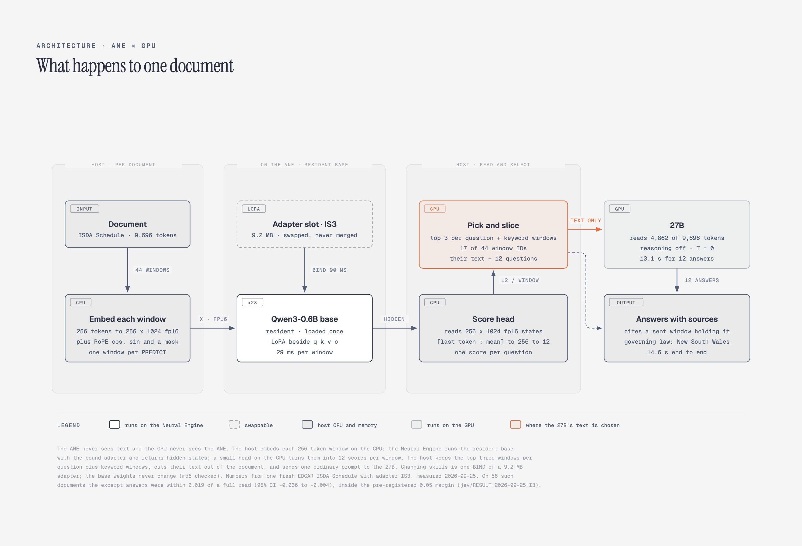

# documents/: the resident base reads documents, the 27B answers from excerpts

The mutable Kev-form base from [`../mutable/`](../mutable/) stays resident on the Apple Neural Engine. A 9.2 MB domain adapter
(contracts, ISDA, arXiv) is bound onto it, the base returns hidden states for every 256-token window of a document; a small head on
the host scores them and picks the windows each question needs. Only the text of those windows goes to a 27B on the GPU, which answers. The GPU never receives
pointers, scores or hidden states: it receives excerpt text and the questions.



[`media/isda_arxiv_two_adapters.mp4`](media/isda_arxiv_two_adapters.mp4): live and uncut, 40 s. An ISDA Schedule read with adapter IS3
(bound in 73 ms, 17 of 44 windows sent, 4,862 of 9,696 tokens, 12.5 s end to end), then an arXiv paper with AX2 (81 ms, 19 of 66
windows, 5,339 of 14,617 tokens, 14.6 s), restoring the default adapter CUA between documents. The demo has since changed: it swaps
only when the next document needs a different adapter and no longer restores CUA in between (a same-type document binds nothing). [Sequence diagram](media/ane_gpu_two_adapters.png).

The test results below come from pre-registered evaluations; swap characterization and demo timings are separately identified. All ran
on an M5 Pro (macOS 27.0, 26A5421a) with the 27B `incoai/Qwen3.8-27B-Splash` (temperature 0, reasoning off). The pre-registration, the result, the raw run log and the adjudication records ship with each test.

## Results

**PIPE** = the ANE picks the windows, the 27B reads only those. **FULL** = the 27B reads the whole document. Contract, ISDA and paper-profile
comparisons use blind Claude-subagent adjudication of disagreements; A4/A4b use anchored Papers with Code gold. Disagreement-only
adjudication estimates PIPE - FULL; it does not establish either arm's absolute accuracy, since shared answers can be wrong. The bar
for every test was frozen before each test run: PIPE - FULL, lower 95% bound >= -0.05, clustered by document.

| test | documents | PIPE - FULL (95% CI) | 27B tokens, PIPE vs FULL | time per doc, PIPE vs FULL | verdict |
|---|---|---|---|---|---|
| ISDA elections, I3 | 56 fresh EDGAR ISDA Schedules/Masters, 12 questions (672) | **-0.019 [-0.036, -0.004]** | about half | median -9.2 s [-11.7, -7.5] | PASS |
| arXiv paper profile, A5 | 56 fresh papers, 12 questions (672) | **-0.010 [-0.027, +0.004]** | 1/3 | 17.1 vs 41.6 s | PASS |
| arXiv table number, A4 | 67 papers, one number from a results table | -0.204 [-0.298, -0.118] | | 10.0 vs 42.9 s | **NOT PASS** |
| same, headers kept, A4b | 64 fresh papers | -0.136 [-0.224, -0.053] | | 13.1 vs 39.2 s | **NOT PASS** |
| contract values, A'' | 60 fresh public contracts, 4 questions (240) | -0.021 [-0.046, 0] | 2,671 vs 13,062 | 7.40 vs 26.93 s | PASS (borderline, kappa 0.323) |
| contract values, A''' | 200 fresh public contracts (800) | **-0.011 [-0.021, -0.001]** | 2,659 vs 13,067 | 7.5 vs 26.9 s | PASS |

- **A small real deficit remains.** In I3 and A''' the upper bound is below 0: PIPE is about 1 to 2 points worse than FULL, non-inferior at
  the declared margin, not equal.
- **Pipelining (B2).** Mapping the next contract on the ANE while the 27B answers the current one raised throughput by **+46% [44, 49]**
  over running them back to back (24 contracts, 5 reps, 0/24 response mismatches in every rep).
- **Swaps are exact.** In I3, A4, A4b and A5, binding one adapter, then others, then the first again reproduced the first adapter's hidden states
  bit for bit, and the base `weight.bin` md5 never changed (G-SWAP). Warm binds measured 65 to 98 ms on this build; of a ~70 ms bind,
  the adapter-value fill is ~5 ms and the rest is cached instantiation and binding (`results/CHARACTERIZATION_2026-09-25_bind_split.md`).
- **The arXiv table task failed twice and the design changed.** Pulling one number out of a results table lost headers and missed rows;
  keeping headers (A4b) recovered +0.094 [+0.022, +0.171] of it, not enough. A 12-question paper profile (A5) passed.

**Scope.** Each PASS holds for its question set and document population. A5 holds for these 12 questions on papers from this snapshot,
nothing wider. None of this is a claim about the ANE being faster than the GPU: the ANE's job is choosing what the GPU reads.

### How accuracy was judged
A4 and A4b have no adjudication: they are graded against anchored Papers with Code gold. Everywhere else, only disagreements between
PIPE and FULL are adjudicated. Each goes, blind (arm labels shuffled, mapping sealed until every verdict is
filed), to two adjudicators working separately; where they differ a third decides. **All adjudicators are fresh Claude sub-agents with
no session context**, so independence is by context and blinding, not by model family. Every verdict, the sealed mapping and each
packet the adjudicators saw are in `<test>/adjudication*/`; the document texts they read are not shipped (see Data).
The designs were co-signed before each run by two reviewers (Claude Code and a GPT-based reviewer); result files call them CC and Astra.

## Layout

| path | what |
|---|---|
| `_kevdoc.py` | every path and endpoint, overridable by environment variable |
| `cuad/` | contracts: CUAD admission, adapter CUA training (A1), ANE parity (A2), A3, A'', A''', long contracts, B2, C |
| `isda2/`, `isda3/` | ISDA: I2 (parent, NOT PASS by 0.004), I3 (PASS), EDGAR fetch, adapter IS3 training |
| `a4/`, `a5/` | arXiv: A4 and A4b (NOT PASS), A5 (PASS), adapter AX2 training |
| `demo/` | the live UI in the video (`demo_server.py`, `index.html`) and its real-time recorder |
| `adapters/` | `CUA.bin`, `IS3.bin`, `AX2.bin`, packed for the mutable base; the trainable form is `<arc>/run_<TAG>/` |
| `results/` | pre-registrations and results. `work/<arc>/` in those files is `documents/<arc>/` here |
| `media/` | the video and the two diagrams, with alt text |

## Running it

Same machine requirements as [`../mutable/`](../mutable/README.md): binding an adapter needs SIP off and
`amfi_get_out_of_my_way=1`. You also need an OpenAI-compatible chat endpoint serving a 27B-class model (`KEV_LLM_URL`, `KEV_LLM_MODEL`)
and `pip install -e '..[parity]' mlx mlx-lm transformers safetensors`.

`../mutable/deploy_inputs.py` imports `qwen_ane` from [`ane-mutable-adapters`](https://github.com/MidasMulli/ane-mutable-adapters)
(`qwen/`) and, like the rest of `mutable/`, still carries its original path constants; set those first (`../mutable/README.md`, Paths).

```sh
python ../mutable/deploy_inputs.py g0 _out 256        # compile the mutable base once
sudo cp -R _out/kev_inputs.mlmodelc /Library/Caches/com.apple.aned/
./build_kevd.sh                                      # build + sign the resident daemon (first bind of a new build is slow once)
export KEV_TRUST_DIR="${KEV_TRUST_DIR:-/var/db/AppleIntelligencePlatform/AppModelAssets/w2d}"
sudo mkdir -p "$KEV_TRUST_DIR" && sudo cp adapters/*.bin "$KEV_TRUST_DIR/"
python demo/demo_server.py                           # http://127.0.0.1:8733, drop in an ISDA Schedule, an arXiv .tex or a contract
```

**Recompute a verdict from the shipped records** (no ANE, no 27B): `cd isda3 && python i3_score.py`, `cd a5 && python a5_score.py adj_all 999`,
`cd cuad && python a3p_score.py`, `cd a4 && python a4_score.py`, `python a4b_score.py`.

**Verified from a clean clone of this repo (2026-09-26):** every scorer above reproduces every field of its stored result; `build_kevd.sh`
builds a daemon whose hidden states are bit-identical to the one used for the results; and `demo/demo_server.py`, given the two
documents in the video, picks the same windows, sends the same token counts and returns the same 12 answers with the same grounding as
the original. Not re-run from the clone: the base compile, training, and the full tests (hours of ANE and 27B time each).

**Rerun a test end to end:** rebuild its corpus (Data), then `<arc>/*_train.py` and `<arc>/*_test.py` in the order the result file gives.
Every run asserts `gate0.py` (memory pressure) before starting and is watched by `red_sentinel.sh`, which kills it on RED. Training uses
MLX on the GPU; the tests drive the ANE and the 27B.

## Data

Document texts are not shipped; the builders regenerate them and the splits pin every document by id.
- **CUAD** (CC BY 4.0): download `CUAD_v1` into `cuad/CUAD_v1/`.
- **Fresh contracts** and the **ISDA I2 corpus**: Pile of Law `atticus_contracts` shards (public EDGAR exhibits),
  `cuad/fresh/build_fresh*.py`, `isda2/scan_master.py`.
- **ISDA I3**: `isda3/edgar_fetch.py` pulls from SEC EDGAR full-text search. Set `SEC_USER_AGENT="your-name your-email"` first
  (SEC fair-access policy); the script refuses to run without it.
- **arXiv**: `a4/a4_fetch_hf.py` and `a5/a5_corpus.py` build from the Hugging Face snapshot `secemp9/arxiv-complete`.

The adapters were trained on the sources listed above. Source licenses and the adapters' distribution license are distinct; consult both
before reuse.
